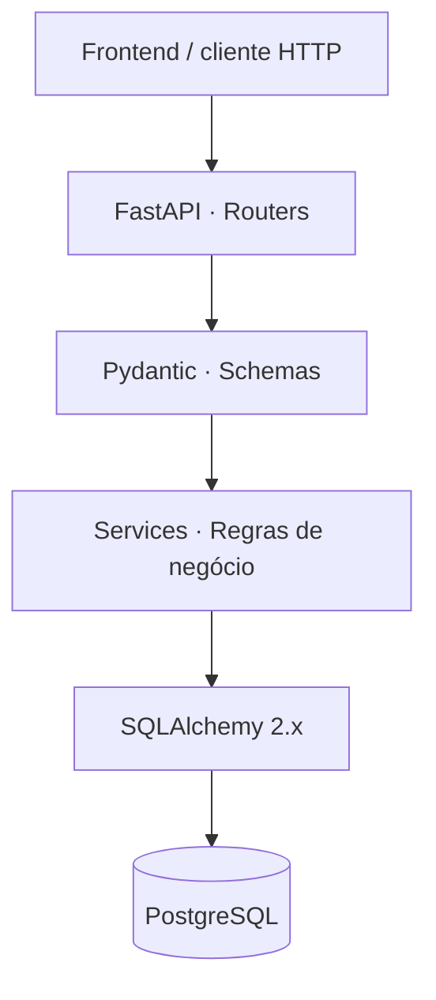
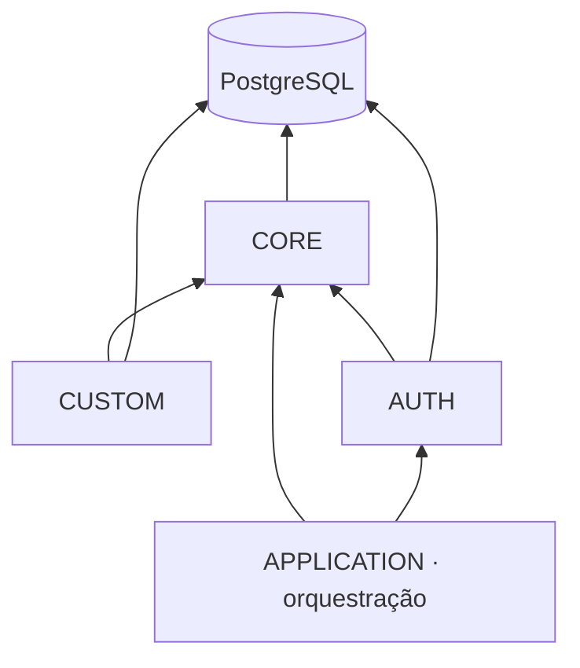
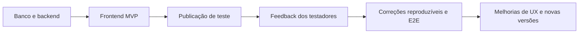

<p align="center">
  
</p>

<p align="center">
  <strong>Controle de estoque confiável, com estrutura preparada para diferentes negócios.</strong><br />
  API modular · Multiempresa · Campos personalizados · Frontend React
</p>

<p align="center">
  
  
  
  
</p>

<p align="center">
  <a href="#visão-geral">Visão geral</a> ·
  <a href="#capacidades">Capacidades</a> ·
  <a href="#arquitetura">Arquitetura</a> ·
  <a href="#executar-localmente">Executar localmente</a> ·
  <a href="#estado-atual-e-roadmap">Estado e roadmap</a>
</p>

---

## Visão geral

O **Estoque Flex** é um sistema web de gerenciamento de estoque multiempresa, pensado para negócios que precisam de rastreabilidade sem abrir mão da flexibilidade. O núcleo mantém as regras operacionais do estoque, enquanto uma camada configurável permite que cada empresa descreva seus itens sem criar colunas específicas para cada negócio.

> **CORE controla o estoque. CUSTOM descreve o estoque. AUTH protege o acesso.**

O projeto possui uma API em FastAPI e uma interface web inicial em React/Vite. A interface já foi integrada aos principais fluxos implementados e passou por validações locais. Este README registra o estado conhecido em **13/10/2026**. A publicação na internet, a migração de uma cópia do banco para um ambiente de testes e a validação E2E completa ainda estão pendentes.

## Capacidades

<table>
  <tr>
    <td width="33%" valign="top">
      <h3>📦 CORE</h3>
      <p>Regras operacionais e dados estruturados.</p>
      <ul>
        <li>Empresas e unidades de medida</li>
        <li>Cadastro, consulta e atualização de itens</li>
        <li>Ativação e inativação de itens e unidades</li>
        <li>Registro de entradas, saídas e ajustes</li>
        <li>Consulta de saldos e estoque baixo</li>
        <li>Inventários, contagens e conclusão/cancelamento</li>
        <li>Histórico de movimentações por item</li>
      </ul>
    </td>
    <td width="33%" valign="top">
      <h3>🧩 CUSTOM</h3>
      <p>Personalização sem acoplamento inverso ao núcleo.</p>
      <ul>
        <li>Categorias por empresa</li>
        <li>Campos personalizados por categoria</li>
        <li>Opções para campos do tipo lista</li>
        <li>Valores personalizados por item</li>
        <li>Associação de itens a categorias</li>
        <li>Validação da configuração JSON e limites de texto</li>
      </ul>
    </td>
    <td width="33%" valign="top">
      <h3>🔐 AUTH</h3>
      <p>Identidade, contexto e permissões.</p>
      <ul>
        <li>Login com JWT</li>
        <li>Consulta do usuário autenticado</li>
        <li>Contexto empresarial por <code>X-Company-ID</code></li>
        <li>Papéis OWNER, OPERATOR e VIEWER</li>
        <li>Validação de acesso no backend</li>
        <li>Separação de dados entre empresas</li>
      </ul>
    </td>
  </tr>
</table>

### Interface web

A primeira versão do frontend utiliza React, Vite e JavaScript. Ela já contempla os fluxos de interface desenvolvidos para autenticação/contexto, itens, unidades, movimentações, detalhes e configurações de campos personalizados, além de controles de interface orientados por permissões.

O frontend é uma base funcional de MVP, não uma declaração de que todos os fluxos administrativos ou requisitos de produção já estejam concluídos. A gestão global de empresas e o fluxo completo para um OWNER criar e administrar contas de funcionários ainda precisam ser planejados e implementados.

## Arquitetura

O backend segue uma arquitetura de **monólito modular**: módulos separados por domínio, uma API HTTP e uma camada de aplicação para coordenar operações que atravessam módulos.


```mermaid
flowchart TD
    CLIENT[Frontend / cliente HTTP] --> ROUTER[FastAPI · Routers]
    ROUTER --> SCHEMA[Pydantic · Schemas]
    SCHEMA --> SERVICE[Services · Regras de negócio]
    SERVICE --> ORM[SQLAlchemy 2.x]
    ORM --> DB[(PostgreSQL)]
```

### Direção das dependências


```mermaid
flowchart BT
    CUSTOM[CUSTOM] --> CORE[CORE]
    AUTH[AUTH] --> CORE
    APP[APPLICATION · orquestração] --> CORE
    APP --> AUTH
    CORE --> DB[(PostgreSQL)]
    AUTH --> DB
    CUSTOM --> DB
```

A direção é intencional: **CORE não importa AUTH nem CUSTOM**. Operações que exigem coordenação entre domínios ficam na camada `application`. CUSTOM pode depender de CORE, mas o inverso é proibido.

### Princípios de domínio

- **Saldo rastreável:** movimentações sustentam as consultas de saldo; o saldo não é um campo manualmente editável no item.
- **Precisão decimal:** quantidades operacionais usam precisão compatível com `NUMERIC(18,4)`.
- **Histórico preservado:** movimentações não devem ser apagadas para ocultar erros operacionais.
- **Multiempresa:** consultas e mutações protegidas devem respeitar a empresa do contexto e validar os registros relacionados.
- **Integridade de estoque:** saídas são validadas contra o saldo e as regras do domínio; há teste automatizado para um cenário crítico de concorrência.
- **CUSTOM sem acoplamento inverso:** campos configuráveis estendem o núcleo sem fazer CORE depender de CUSTOM.
- **PATCH previsível:** campos omitidos não devem ser alterados; a nulabilidade segue o contrato do schema.

## Tecnologias

| Camada | Tecnologias |
|---|---|
| API | Python, FastAPI, Pydantic |
| Persistência | SQLAlchemy 2.x, PostgreSQL, scripts SQL do projeto |
| Autenticação | JWT/PyJWT, Argon2 |
| Testes de backend | pytest, FastAPI TestClient e cliente HTTP de testes |
| Frontend | React, Vite, JavaScript, CSS |
| Ferramentas de desenvolvimento | Python, Node.js/npm, VS Code |

## Qualidade e status

| Área | Estado | Observação |
|---|---|---|
| Banco local / Gate A | ✅ Concluído | Estruturas CORE, AUTH e CUSTOM aplicadas e validadas no ambiente de desenvolvimento. |
| Fundação do backend | ✅ Implementada | FastAPI, configuração, persistência, segurança e testes. |
| AUTH e multiempresa | ✅ Implementados | JWT, usuário atual, membership, papéis e contexto empresarial. |
| APIs CORE | ✅ Implementadas | Empresas, unidades, itens, movimentações, estoque e inventários. |
| API CUSTOM | ✅ Implementada | Categorias, campos, opções, valores e associação com itens. |
| Paginação | ✅ Implementada nas listas selecionadas | Limites e offsets validados; consulte a OpenAPI para o contrato de cada rota. |
| Limites de texto | ✅ Implementados | Texto curto: 255; texto longo: 10.000; descrições: 2.000; observações: 5.000 caracteres. |
| Configuração de campos | ✅ Validada | Objeto JSON serializado limitado a 16 KiB, validado no schema e no serviço. |
| Concorrência de saídas | ✅ Testada | Teste de regressão verifica que duas saídas incompatíveis não deixam o saldo negativo. |
| Frontend React/Vite | ✅ Implementado em nível de MVP | Lint, build e testes manuais registrados como aprovados. |
| Suíte de backend | ✅ 468 testes aprovados | Última execução local registrada: `468 passed in 19.56s`. |
| Lint e build do frontend | ✅ Aprovados | `npm run lint` e `npm run build` concluídos sem erros na última validação registrada. |
| Publicação na internet | ⏳ Pendente | Ambiente do backend, frontend e variáveis de implantação ainda precisam ser configurados. |
| Banco remoto para testes | ⏳ Em preparação | Projeto criado no Neon; exportação/importação dos dados locais ainda não realizada. |
| Testes E2E | ⏳ Pendente | Validar os fluxos principais de ponta a ponta. |
| Administração global e contas de funcionários | ⏳ Planejado | Não tratar como funcionalidade já concluída. |

> **Nota sobre prontidão:** o hardening preventivo desta fase foi encerrado para permitir que o MVP avance. Isso não significa que todas as condições de produção estejam resolvidas. Problemas concretos de contrato, permissão, integridade ou consistência devem ser reproduzidos e corrigidos com testes de regressão.

Os números acima registram execuções locais informadas durante o desenvolvimento; não representam, por si só, um status de CI/CD remoto.

## Organização do repositório

```text
.
├── backend/
│   ├── app/
│   │   ├── application/   # Orquestração entre domínios
│   │   ├── auth/          # Autenticação e autorização
│   │   ├── core/          # Regras fundamentais do estoque
│   │   ├── custom/        # Categorias e campos configuráveis
│   │   ├── health/        # Health check
│   │   └── shared/        # Configuração, banco e utilitários comuns
│   ├── tests/             # Testes de serviços e APIs
│   ├── requirements.txt
│   └── .env.example
├── frontend/
│   ├── src/               # Interface React e cliente da API
│   └── package.json
├── database/
│   ├── core/
│   ├── auth/
│   ├── custom/
│   └── apply_all.sql      # Aplicação em banco novo
├── docs/
│   └── assets/            # Recursos visuais da documentação
├── pytest.ini
└── README.md
```

A árvore é resumida; consulte os diretórios para ver todos os arquivos existentes.

## Executar localmente

Este guia explica como instalar o Estoque Flex em uma máquina Windows usando CMD, Python, PostgreSQL e Node.js. Execute os comandos na raiz do repositório, salvo quando indicado.

### Pré-requisitos

Instale o Git, Python, PostgreSQL, Node.js e npm. O comando `psql` deve estar disponível no terminal, e o servidor PostgreSQL precisa estar em execução.

### 1. Clonar o repositório

```bat
git clone https://github.com/GabrielJalmeida/baby-belo.git
cd baby-belo
```

Se você já clonou o repositório, entre na pasta existente em vez de cloná-lo novamente.

### 2. Criar o ambiente Python

Na raiz do projeto, execute:

```bat
py -m venv .venv
.venv\Scripts\activate
python -m pip install -r backend\requirements.txt
```

Confirme que `(.venv)` aparece no início do terminal. Sempre ative esse ambiente antes de instalar dependências ou executar a API e os testes.

### 3. Configurar o ambiente

Crie o arquivo local a partir do exemplo:

```bat
copy backend\.env.example backend\.env
```

Abra `backend\.env` e configure:

- `DATABASE_URL`: conexão com o banco principal local, inicialmente `estoque_flex_dev`.
- `SECRET_KEY`: chave aleatória usada para assinar tokens JWT.
- `CORS_ALLOWED_ORIGINS`: origens locais permitidas para o frontend.

Gere uma chave aleatória executando:

```bat
python -c "import secrets; print(secrets.token_urlsafe(48))"
```

Copie o resultado para `SECRET_KEY`. Configure a `DATABASE_URL` com o usuário, a senha, o endereço e a porta corretos do PostgreSQL. Se a senha tiver caracteres especiais, codifique-os adequadamente para uso em uma URL.

Não compartilhe nem publique `backend\.env`. Ele contém credenciais locais e uma chave secreta; o `.env.example` deve conter apenas valores fictícios.

### 4. Criar os bancos locais

A suíte atual usa o banco configurado em `DATABASE_URL` e um banco auxiliar chamado `estoque_flex_auth_test`.

Com o PostgreSQL em execução, crie os dois bancos:

```bat
psql -U postgres -d postgres -c "CREATE DATABASE estoque_flex_dev;"
psql -U postgres -d postgres -c "CREATE DATABASE estoque_flex_auth_test;"
```

Se algum banco já existir, não tente criá-lo de novo. Confira se é um banco local dedicado a esta instalação e se pode ser utilizado com segurança.

Se seu usuário PostgreSQL não for `postgres`, adapte os comandos à sua instalação e às permissões disponíveis.

### 5. Aplicar o schema nos dois bancos

Ainda na raiz do repositório, execute:

```bat
psql -h localhost -p 5432 -U postgres -d estoque_flex_dev -v ON_ERROR_STOP=1 -f database\apply_all.sql
```

Depois, prepare o banco auxiliar:

```bat
psql -h localhost -p 5432 -U postgres -d estoque_flex_auth_test -v ON_ERROR_STOP=1 -f database\apply_all.sql
```

Cada comando aplica os scripts de CORE, AUTH e CUSTOM, incluindo tabelas, relacionamentos, restrições, índices, funções e gatilhos.

A mensagem esperada no final de cada execução é:

```text
Estoque Flex: schema aplicado com sucesso.
```

A `DATABASE_URL` em `backend\.env` deve apontar para `estoque_flex_dev`, com as credenciais corretas. Os testes de autenticação usam o banco auxiliar separadamente.

**Importante:** `database\apply_all.sql` prepara um schema em um banco novo; não é um mecanismo de atualização de bancos existentes. Não o reaplique indiscriminadamente em bancos que já contenham dados.

### 6. Executar a suíte de testes

Com `(.venv)` ativo e os dois bancos preparados, execute na raiz:

```bat
python -m pytest backend\tests -q
```

A suíte valida serviços, endpoints, autenticação, isolamento entre empresas, integridade do banco e concorrência.

Os testes criam e limpam registros temporários. Alguns procedimentos de limpeza desativam temporariamente gatilhos de proteção dentro de transações de teste. **Execute a suíte somente contra bancos locais dedicados aos testes, nunca contra produção.**

Se houver erro, examine primeiro a causa específica:

- `password authentication failed`: confira usuário e senha na `DATABASE_URL`.
- `database does not exist`: crie o banco indicado pelo erro.
- `relation does not exist`: confira se o schema foi aplicado ao banco correto.
- `No module named ...`: ative a `.venv` e instale as dependências.
- Erro de `SECRET_KEY`: confirme se a variável existe e contém uma chave suficientemente longa.

### 7. Iniciar a API

Na raiz do projeto, com a `.venv` ativa, execute:

```bat
uvicorn app.main:app --reload --app-dir backend
```

A API estará disponível em `http://127.0.0.1:8000`.

Documentação interativa:

- Swagger UI: http://127.0.0.1:8000/docs
- ReDoc: http://127.0.0.1:8000/redoc

Mantenha esse terminal aberto enquanto utilizar o sistema.

### 8. Iniciar o frontend

Abra um segundo terminal CMD, na raiz do repositório, e execute:

```bat
cd frontend
npm install
npm run dev
```

Abra no navegador a URL informada pelo Vite, normalmente `http://localhost:5173`.

Se a interface não conseguir acessar a API, confira `frontend/src/api.js` e a configuração do Vite para verificar a URL utilizada pelo frontend.

### 9. Validar o frontend

Ainda na pasta `frontend`, execute:

```bat
npm run lint
npm run build
```

O primeiro comando verifica o lint e o segundo valida a compilação de produção.

### Resumo da ordem de instalação

1. Clonar o repositório e preparar a `.venv`.
2. Configurar `backend\.env`.
3. Criar `estoque_flex_dev` e `estoque_flex_auth_test`.
4. Aplicar `database\apply_all.sql` nos dois bancos.
5. Executar `python -m pytest backend\tests -q`.
6. Iniciar a API e o frontend em terminais separados.
7. Executar o lint e o build do frontend.

## API

A API usa o prefixo `/api/v1`. Os grupos principais são:

| Grupo | Recursos |
|---|---|
| AUTH | Login e consulta do usuário autenticado (`/api/v1/auth/...`) |
| Empresas | Criação, listagem, consulta e atualização de empresas |
| Unidades | Cadastro, listagem, atualização e ativação/inativação conforme as regras implementadas |
| Itens | Cadastro, consulta, atualização e ativação/inativação conforme as regras implementadas |
| Movimentações | Entradas, saídas, ajustes e histórico por item |
| Estoque | Saldos e itens com estoque baixo |
| Inventários | Abertura, contagem, conclusão, cancelamento e consulta do snapshot |
| CUSTOM | Categorias, campos, opções, valores e associação de categorias aos itens |

As listas que possuem paginação usam `limit` com padrão 50 e máximo 100 e `offset` com padrão 0. O detalhe de inventário preserva o snapshot completo dos itens; não deve ser truncado pelo limite da rota de listagem. Consulte `/docs` para os caminhos, verbos HTTP, parâmetros, schemas e respostas atuais.

## Segurança e limites conhecidos

- Senhas são armazenadas com hash, não em texto puro.
- JWT tem expiração e validação de assinatura; a chave é validada conforme o algoritmo HMAC configurado.
- Papéis e membership são validados no backend; controles visuais no frontend não substituem autorização na API.
- `X-Company-ID` define o contexto da empresa para operações protegidas; o cliente não é a fonte de autorização.
- CORS deve usar origens explicitamente configuradas, especialmente no ambiente hospedado.
- Limites por campo e configuração JSON não substituem um limite global do corpo HTTP.
- Limite global do corpo HTTP e logging estruturado para produção ainda precisam ser definidos conforme a infraestrutura de implantação.
- Ainda não há idempotência geral para todas as requisições de movimentação. Reenvios de uma criação de movimento podem gerar uma segunda operação válida; considerar esse comportamento na integração.
- Nunca registrar tokens completos, senhas, `SECRET_KEY` ou URLs de banco com credenciais.
- O ambiente de testes hospedado não deve ser tratado como sistema de produção nem conter dados sensíveis reais.

## Estado atual e roadmap


```mermaid
flowchart LR
    A[Banco e backend] --> B[Frontend MVP]
    B --> C[Publicação de teste]
    C --> D[Feedback dos testadores]
    D --> E[Correções reproduzíveis e E2E]
    E --> F[Melhorias de UX e novas versões]
```

### Próximo marco: ambiente web para testadores

1. Confirmar o estado local e os commits no Git antes de alterar a implantação.
2. Fazer um backup/exportação do PostgreSQL local e importar uma cópia para o Neon, preservando intacto o banco local.
3. Hospedar a API FastAPI e configurar no serviço de backend as variáveis de ambiente necessárias, incluindo a URL do Neon.
4. Hospedar a interface React/Vite e configurar sua URL de API.
5. Validar login, contexto de empresa, permissões, itens, unidades, movimentações, inventários e CUSTOM pela internet.
6. Liberar o ambiente para testes e registrar os problemas encontrados antes de priorizar novas melhorias.

A prioridade é usar uma cópia de teste com os dados atuais relevantes, permitindo que testadores criem, alterem e removam os registros que o sistema autoriza. Alterações realizadas no banco remoto não devem modificar o PostgreSQL local.

### Evolução planejada

- Observar o uso real e corrigir bugs reproduzíveis, sem reiniciar uma auditoria preventiva geral sem motivo concreto.
- Refinar a hierarquia visual, responsividade e clareza dos estados de carregamento, vazio, sucesso e erro.
- Ampliar os testes E2E dos fluxos mais importantes.
- Planejar administração global de empresas e o fluxo de criação/gestão de contas de funcionários.
- Reavaliar logging, limite global do corpo HTTP e idempotência das movimentações antes de usos que exijam garantias adicionais.

O frontend deve consumir a API e não duplicar as regras do domínio. Traduzir erros `401`, `403`, `404`, `409` e `422` em mensagens compreensíveis; não indicar sucesso quando a API rejeitar uma operação.

## Recursos do projeto

- [Scripts e estrutura do banco](database/)
- [Dependências do backend](backend/requirements.txt)
- [Configuração de ambiente de exemplo](backend/.env.example)
- [Documentação da API após iniciar o backend](http://127.0.0.1:8000/docs)

---

<p align="center">
  <strong>Estoque Flex</strong><br />
  <sub>Estrutura estável para o que é crítico. Flexibilidade para o que muda.</sub>
</p>
